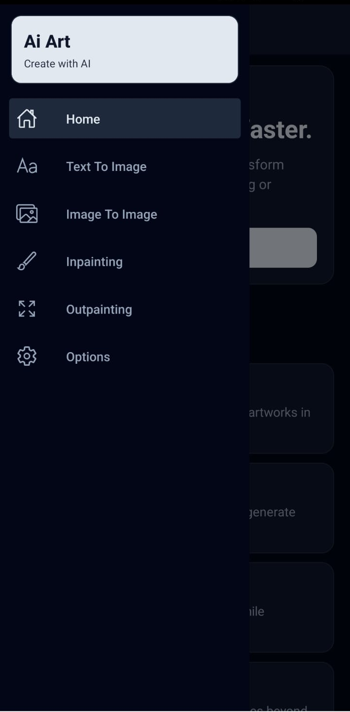
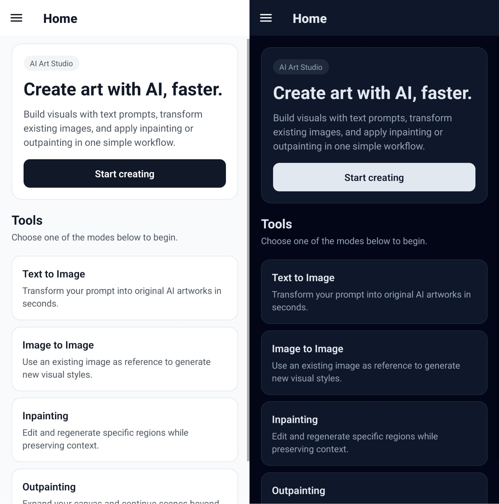
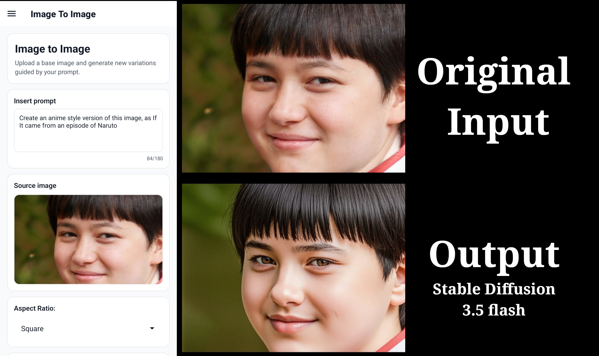

# AiArtReactNative

AiArtReactNative is a mobile app for generating AI art with a clean drawer-based workflow: Text to Image, Image to Image, Inpainting, and Outpainting. It lets users write prompts, upload reference images, tune sample settings, and preview generated outputs directly on-device with Expo.

The app is built with React Native + Expo (SDK 48), React Navigation (Drawer), and a multi-provider image API layer supporting:

- Google Gemini (`gemini-2.5-flash-image`)
- Stability AI SD3.5 Flash (`sd3.5-flash`)

It also includes a theme system (Light/Dark/System), persisted preferences, provider selection in Options, and resilient API error handling.

# Examples

## Screens

	<figure style="flex:1;min-width:220px;text-align:center;margin:0;">
		
		<figcaption>Options menu</figcaption>
	</figure>
	<figure style="flex:1;min-width:220px;text-align:center;margin:0;">
		
		<figcaption>Sidebar</figcaption>
	</figure>
	<figure style="flex:1;min-width:220px;text-align:center;margin:0;">
		
		<figcaption>Title screen</figcaption>
	</figure>

	<figure style="display:inline-block;max-width:820px;margin:0;">
		
		<figcaption>Image to Image</figcaption>
	</figure>

## Architecture highlights

### 1) Multi-provider image generation

The app now supports multiple backends and switches between them at runtime:

- Provider type contracts: `api/ImageApiTypes.ts`
- Abstract Factory: `api/ImageApiFactory.ts`
- Provider-agnostic service facade: `api/ImageApiService.ts`
- Gemini handler: `api/GeminiAPI.ts`
- Stability handler: `api/StabilityApi.ts`

UI screens (`TextToImage`, `ImageToImage`, `ImageEdit`) call only the service layer, not a provider directly.

### 2) Abstract Factory + Service flow

1. User selects provider in `Options` (Gemini or Stability).
2. Selection is persisted with AsyncStorage.
3. `ImageApiService` requests the selected provider.
4. `ImageApiFactory` instantiates the corresponding handler.
5. Generation calls execute through a unified interface.

This keeps screen code stable while allowing provider-specific implementations behind the scenes.

### 3) Circuit breaker + error strategy

Both provider handlers implement a circuit breaker pattern:

- Open circuit after repeated failures.
- Temporary cooldown window before retry attempts.
- Auto-reset on successful requests.

Error messaging strategy:

- Developer logs receive detailed API errors (`console.error`) for debugging.
- End users receive sanitized, actionable messages (e.g., timeout, quota busy, invalid request) instead of raw provider payloads.

## Stability API implementation details

- Endpoint: `https://api.stability.ai/v2beta/stable-image/generate/sd3`
- Model used for testing/cost control: `sd3.5-flash`
- Request format: `multipart/form-data`
- Text-to-image: sends `prompt` + `aspect_ratio`
- Image-to-image: sends `mode=image-to-image` + `image` + `strength` (without `aspect_ratio`)
- Input image size check: max 10MiB

## Quick setup

- Use `Node.js 18.x`, `npm 9+`, `Expo CLI` via `npx`, and `OpenJDK 17` (Android builds).
- Configure environment variables in `.env`:
	- `EXPO_PUBLIC_GEMINI_API_KEY=...`
	- `EXPO_PUBLIC_STABILITY_API_KEY=...`
- Install Android tooling: Android SDK (with `platform-tools`/`adb`) and set `ANDROID_HOME` + `PATH` to include `$ANDROID_HOME/platform-tools`.
- Install dependencies: `npm install`.
- Start development: `npx expo start -c`.

## Provider selection

- Open the `Options` screen.
- In the **Image provider** section, choose:
	- `Gemini`
	- `Stability AI (SD 3.5 Flash)`

The selected provider is persisted and used across generation screens.

# License 

MIT